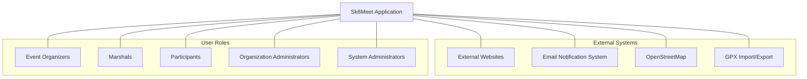
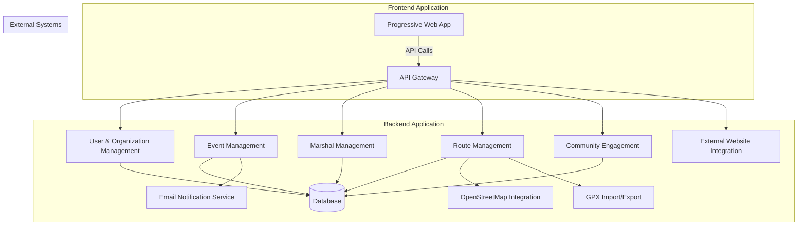
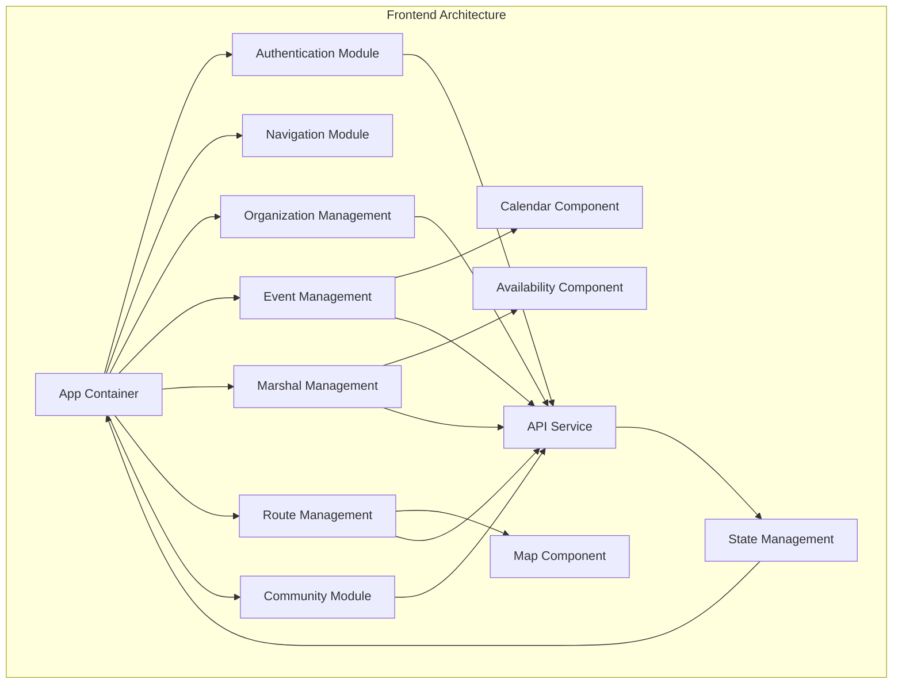
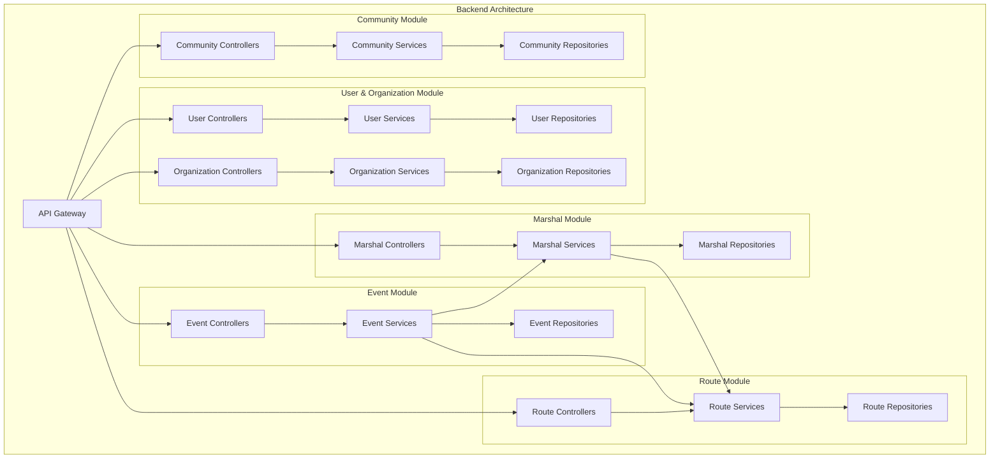
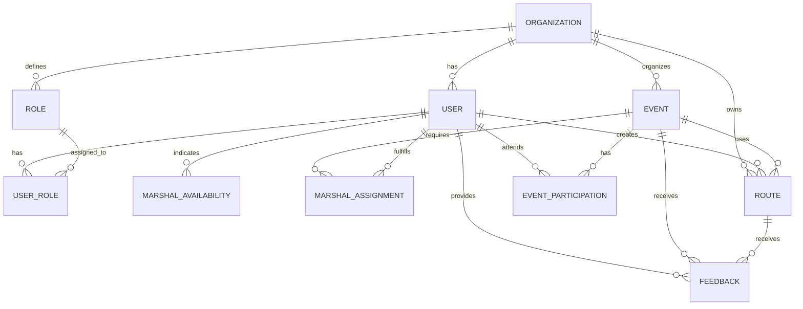
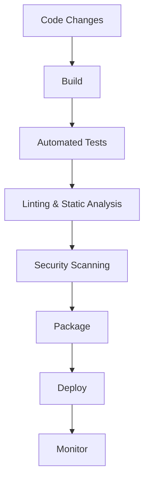
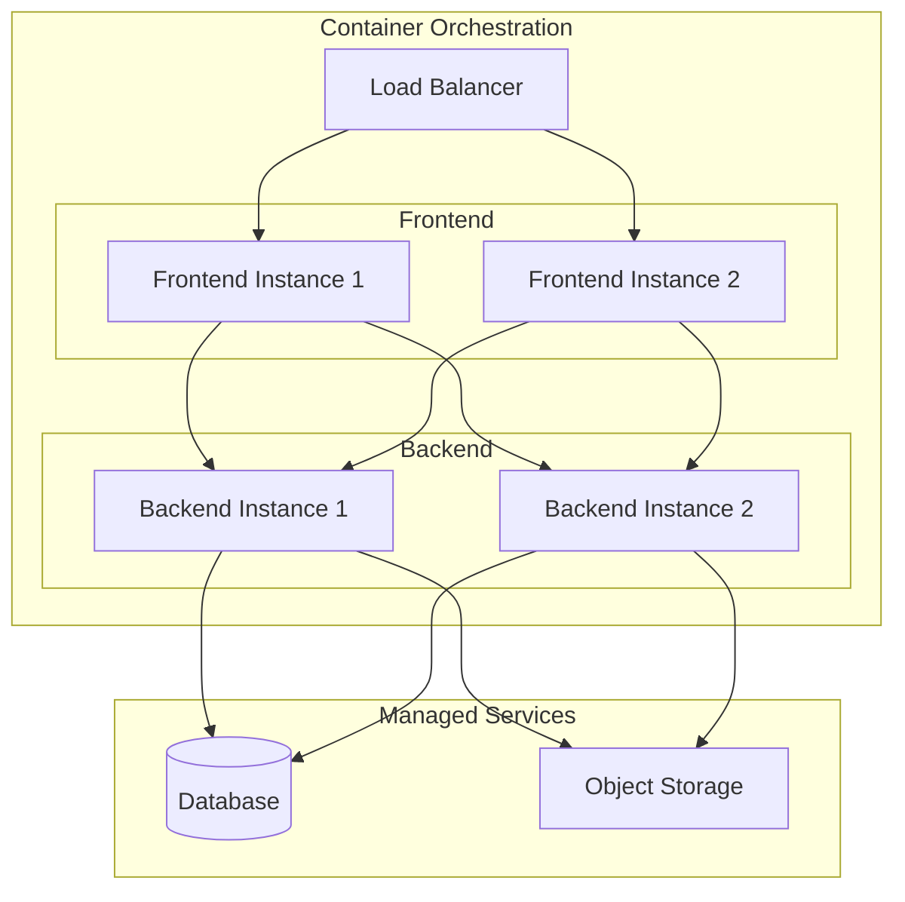

# Sk8Meet Architecture Document

## 1. Executive Summary

Sk8Meet is a comprehensive platform designed to transform how street skating events are organized, promoted, and experienced. This document outlines the architectural approach for implementing Sk8Meet as a mobile-first, cost-effective solution that meets the needs of skating communities worldwide.

The architecture is designed with the following key principles in mind:

- Simplicity and understandability for developers with various experience levels
- Cost-effective deployment and hosting
- Hosting provider independence through containerization
- Mobile-first approach with cross-platform support
- Limited tech stack diversity to simplify development and maintenance
- Clear separation of frontend and backend concerns
- Infrastructure as code for consistent, repeatable deployments
- DevOps practices for efficient development and deployment workflows

The recommended architecture is a **modular monolith** with clear separation of concerns, deployed as containerized applications with a managed database service. A modular monolith is a single deployable unit that contains clearly defined internal modules with well-established boundaries, allowing for simpler development and deployment while maintaining good separation of concerns. This approach balances simplicity, cost-effectiveness, and flexibility for future growth, while minimizing the complexity that would come with a microservices architecture.

## 2. Architecture Principles and Constraints

### Principles

1. **Simplicity First**
   - Favor straightforward solutions over complex ones
   - Minimize the learning curve for new developers
   - Use established, well-documented technologies

2. **Cost Optimization**
   - Design for minimal infrastructure costs
   - Leverage managed services where they provide cost benefits
   - Optimize resource utilization

3. **Separation of Concerns**
   - Clear boundaries between frontend and backend
   - Well-defined interfaces between components
   - Modular design for independent development and testing

4. **Mobile-First Design**
   - Optimize for mobile user experience
   - Support offline capabilities where appropriate
   - Ensure responsive design for all screen sizes

5. **API-First Approach**
   - Design APIs before implementing functionality
   - Consistent API design patterns
   - Comprehensive API documentation

6. **DevOps Culture**
   - Automated testing and deployment
   - Infrastructure as code
   - Continuous integration and continuous deployment
   - Monitoring and observability

7. **Future Extensibility**
   - Design modules with clear boundaries and interfaces
   - Enable extraction of specific modules into separate services as needed
   - For example, route planning functionality could be extracted as a standalone service if it becomes more complex
   - Ensure modules communicate through well-defined interfaces to facilitate future separation

### Constraints

1. **Technical**
   - Limited diversity in tech stack
   - Must support mobile-first development
   - Must be hosting provider agnostic
   - Must support infrastructure as code

2. **Organizational**
   - Small development team with stronger backend experience
   - Limited resources for operations and maintenance

3. **Business**
   - Cost-sensitive deployment and hosting
   - Must support different organizational structures
   - Must be adaptable to various skating community needs

4. **Compliance**
   - GDPR compliance for European users
   - Data minimization principles
   - Secure user authentication and data protection

## 3. System Context and Stakeholders

### System Context Diagram

The system context diagram from the provided documentation shows Sk8Meet and its interactions with external systems and user roles:



### External System Interactions

1. **External Websites**
   - Consume event data via API
   - Display upcoming events
   - Link back to Sk8Meet for registration

2. **Email Notification System**
   - Send event notifications to distribution lists
   - Deliver system notifications to users
   - Provide event updates (e.g., go/no-go decisions)

3. **OpenStreetMap**
   - Provide map data for route planning
   - Display routes with skating-specific metadata
   - Support mobile navigation during events

4. **GPX Import/Export**
   - Import routes from external planning tools
   - Export routes for use in other applications
   - Ensure compatibility with standard GPS formats

## 4. High-Level Architecture Overview

### Architectural Style and Patterns

Sk8Meet will be implemented as a **modular monolith** with the following characteristics:

1. **Single Deployment Unit**: The backend application is deployed as a single unit, simplifying deployment and operations.

2. **Internal Modularity**: The application is organized into distinct modules with clear boundaries and responsibilities.

3. **Well-Defined Interfaces**: Modules communicate through well-defined interfaces, enabling future extraction into separate services if needed.

4. **Shared Database**: Modules share a database but maintain clear data ownership boundaries through separate database schemas and a hybrid approach to referential integrity.

5. **Decoupled Frontend**: The frontend is developed and deployed separately from the backend, communicating exclusively through APIs.

This approach offers several advantages for Sk8Meet:

- **Simplicity**: Easier to develop, test, and deploy compared to microservices
- **Lower Operational Overhead**: Fewer components to manage and monitor
- **Reduced Complexity**: Simpler communication patterns and fewer failure points
- **Future Flexibility**: Well-defined module boundaries enable future extraction of services
- **Cost Efficiency**: Lower infrastructure costs due to fewer deployed components

### Component Diagram



### Data Flow

1. **User Authentication Flow**
   - User logs in through the frontend application
   - Authentication request is sent to the API Gateway
   - User Management module validates credentials
   - JWT token is returned to the frontend for subsequent requests

2. **Event Creation Flow**
   - Event Organizer creates an event through the frontend
   - Request is sent to the API Gateway
   - Event Management module processes the request
   - Route Management module is consulted for route information
   - Event data is stored in the database
   - Notifications are sent to relevant users via Email Notification Service

3. **Route Planning Flow**
   - Marshal creates a route through the frontend
   - Request is sent to the API Gateway
   - Route Management module processes the request
   - OpenStreetMap Integration provides map data
   - Route data is stored in the database with skating-specific metadata
   - Route can be exported via GPX Import/Export service

## 5. Detailed Architecture

### Frontend Architecture

The frontend will be implemented as a **Progressive Web App (PWA)** to provide a mobile-first experience with offline capabilities. This approach offers several advantages:

1. **Cross-Platform Compatibility**: Works on iOS, Android, and desktop browsers
2. **Offline Functionality**: Essential for marshals in the field
3. **Native-Like Experience**: Fast loading and responsive design
4. **Lower Development Cost**: Single codebase for all platforms
5. **Progressive Enhancement**: Works on older browsers with graceful degradation

#### Component Structure



#### Key Frontend Components

1. **Authentication Module**: Handles user login, registration, and session management
2. **Organization Management**: UI for managing organizations, roles, and permissions
3. **Event Management**: UI for creating, editing, and managing events
4. **Marshal Management**: UI for managing marshal availability and assignments
5. **Route Management**: UI for planning and viewing routes, including map integration
6. **Community Module**: UI for participant engagement and feedback
7. **Map Component**: Interactive map for route planning and viewing
8. **API Service**: Centralizes all communication with the backend API
9. **State Management**: Manages application state and caching for offline functionality

#### Offline Capabilities

The PWA will support the following offline capabilities:

1. **Cached Routes**: Downloaded routes available offline
2. **Event Information**: Basic event details available offline
3. **Data Synchronization**: Changes made offline are synchronized when connectivity is restored
4. **Service Worker**: Manages caching and background synchronization

### Backend Architecture

The backend will be implemented as a modular monolith with clear boundaries between modules. Each module will have its own set of controllers, services, and repositories, but will be deployed as a single application.

#### Module Structure



#### Key Backend Components

1. **API Gateway**: Entry point for all API requests, handles routing, authentication, and basic validation
2. **User & Organization Module**: Manages user accounts, authentication, organizations, roles, and permissions
3. **Event Module**: Handles event creation, management, and notifications
4. **Marshal Module**: Manages marshal availability, assignments, and qualifications
5. **Route Module**: Handles route planning, storage, and integration with mapping services
6. **Community Module**: Manages participant engagement, feedback, and social features

#### Module Communication

Modules will communicate through the following patterns:

1. **Direct Method Calls**: For synchronous communication within the monolith
2. **Event-Driven Communication**: For asynchronous processes and loose coupling
3. **Well-Defined Interfaces**: Clear contracts between modules to enable future separation

### Data Architecture

The data architecture will use a relational database with a clear schema that respects module boundaries. This approach provides:

1. **Data Integrity**: Enforced relationships and constraints
2. **Query Flexibility**: Complex queries across related data
3. **Transaction Support**: ACID properties for critical operations
4. **Familiar Technology**: Well-understood by most developers

#### Database Schema Organization

To enforce clear ownership boundaries at the database level, each module will have its own database schema:

```sql
-- User Management module tables in their own schema
CREATE SCHEMA user_management;

CREATE TABLE user_management.users (
  id UUID PRIMARY KEY,
  email VARCHAR(255) UNIQUE NOT NULL,
  -- other fields
);

-- Event Management module tables in their own schema
CREATE SCHEMA event_management;

CREATE TABLE event_management.events (
  id UUID PRIMARY KEY,
  name VARCHAR(255) NOT NULL,
  creator_id UUID NOT NULL,
  -- other fields
);
```

This schema-based approach provides several benefits:

- Clear visual separation of tables by module
- Database permissions can be set at the schema level
- Schema name provides namespace to avoid table name collisions
- Makes it easier to extract a module to its own database later if needed
- Query analyzers and tools can easily show which module owns which tables

#### Referential Integrity Approach

A **Hybrid Approach** will be used to implement referential integrity across module boundaries:

1. **Within Module Boundaries**:
   - Database-level foreign keys for strong referential integrity
   - Full ACID transaction support
   - Example: Events referencing other events within the event_management schema

2. **Across Module Boundaries**:
   - Application-level integrity checks for looser coupling
   - Database constraints (like NOT NULL) where appropriate
   - Example: Events referencing users from the user_management schema

```sql
-- Example of hybrid approach
CREATE TABLE event_management.events (
  id UUID PRIMARY KEY,
  name VARCHAR(255) NOT NULL,
  creator_id UUID NOT NULL, -- References user but without DB-level foreign key
  parent_event_id UUID,
  -- other fields
  FOREIGN KEY (parent_event_id) REFERENCES event_management.events(id) -- Within-module FK
);
```

The application will enforce cross-module integrity through service-layer checks:

```typescript
// In event-management/services/eventService.ts
async function createEvent(eventData) {
  // Check if user exists (cross-module integrity check)
  const userExists = await userService.userExists(eventData.creatorId);
  if (!userExists) {
    throw new Error('User not found');
  }
  
  // Continue with event creation...
  return eventRepository.createEvent(eventData);
}
```

This hybrid approach balances strong data integrity with the flexibility needed for future evolution of the architecture.

#### Conceptual Data Model



#### Key Data Entities

1. **Organization**: Skating organizations with their specific settings
2. **User**: User accounts with profile information
3. **Role**: Organization-specific roles with permissions
4. **User_Role**: Association between users and roles within organizations
5. **Event**: Skating events with details, status, and routes
6. **Marshal_Availability**: Marshal availability for events
7. **Marshal_Assignment**: Role assignments for marshals at events
8. **Route**: Skating routes with metadata and GPX data
9. **Event_Participation**: Participant registration and attendance
10. **Feedback**: User feedback on events and routes

### API Architecture

The API will follow RESTful design principles with consistent patterns and comprehensive documentation.

#### API Design Principles

1. **Resource-Oriented**: APIs organized around resources
2. **Standard HTTP Methods**: GET, POST, PUT, DELETE for standard operations
3. **JSON Responses**: Consistent JSON formatting for all responses
4. **Pagination**: Standard pagination for list endpoints
5. **Filtering**: Consistent query parameter patterns for filtering
6. **Versioning**: API versioning to support backward compatibility
7. **Error Handling**: Standardized error responses with clear messages

#### Core API Endpoints

1. **Authentication API**
   - `/api/v1/auth/login`
   - `/api/v1/auth/register`
   - `/api/v1/auth/refresh`

2. **Organization API**
   - `/api/v1/organizations`
   - `/api/v1/organizations/{id}`
   - `/api/v1/organizations/{id}/roles`
   - `/api/v1/organizations/{id}/members`

3. **Event API**
   - `/api/v1/events`
   - `/api/v1/events/{id}`
   - `/api/v1/events/{id}/marshals`
   - `/api/v1/events/{id}/participants`
   - `/api/v1/events/{id}/status`

4. **Marshal API**
   - `/api/v1/marshals/availability`
   - `/api/v1/marshals/assignments`
   - `/api/v1/marshals/qualifications`

5. **Route API**
   - `/api/v1/routes`
   - `/api/v1/routes/{id}`
   - `/api/v1/routes/{id}/gpx`
   - `/api/v1/routes/import`

6. **Public API**
   - `/api/v1/public/events`
   - `/api/v1/public/organizations`
   - `/api/v1/public/routes`

### Integration Architecture

The integration architecture will handle connections with external systems through well-defined interfaces.

#### OpenStreetMap Integration

1. **Map Data Service**: Retrieves map data for route planning
2. **Geocoding Service**: Converts addresses to coordinates
3. **Route Rendering Service**: Displays routes on maps

#### Email Notification Integration

1. **Template Service**: Manages email templates
2. **Distribution List Service**: Manages email distribution lists
3. **Delivery Service**: Handles actual email sending

#### External Website Integration

1. **Public API**: Provides event data to external websites
2. **Webhook Service**: Notifies external systems of updates

#### GPX Import/Export

1. **Import Service**: Parses and validates GPX files
2. **Export Service**: Generates GPX files from routes
3. **Conversion Service**: Handles format conversions

## 6. Cross-Cutting Concerns

### Security Architecture

Security is a critical aspect of the Sk8Meet platform, especially considering the personal data involved and GDPR requirements.

#### Authentication and Authorization

1. **JWT-Based Authentication**
   - Stateless authentication using JSON Web Tokens
   - Short-lived access tokens with refresh token mechanism
   - Secure token storage in browser

2. **Role-Based Access Control (RBAC)**
   - Permissions tied to organization-specific roles
   - Fine-grained access control at the API level
   - Support for multiple roles across different organizations

3. **Multi-Factor Authentication (MFA)**
   - Optional MFA for sensitive operations
   - Support for email-based verification codes

#### Data Protection

1. **Encryption**
   - Data encryption at rest for sensitive information
   - TLS encryption for all data in transit
   - Secure handling of authentication credentials

2. **GDPR Compliance**
   - Data minimization principles
   - User consent management
   - Right to access and delete personal data
   - Data export functionality

3. **API Security**
   - Rate limiting to prevent abuse
   - Input validation and sanitization
   - Protection against common attacks (CSRF, XSS, injection)
   - API key management for external integrations

#### Security Monitoring

1. **Audit Logging**
   - Comprehensive logging of security-relevant events
   - User action tracking for accountability
   - Secure log storage and retention

2. **Vulnerability Management**
   - Regular security scanning in CI/CD pipeline
   - Dependency vulnerability monitoring
   - Security patch management process

### Performance and Scalability

The architecture is designed to provide good performance while maintaining cost-effectiveness.

#### Performance Considerations

1. **Frontend Performance**
   - Optimized asset loading and caching
   - Lazy loading of components and routes
   - Efficient state management
   - Minimized network requests

2. **Backend Performance**
   - Query optimization for database operations
   - Caching of frequently accessed data
   - Efficient API responses with appropriate pagination
   - Background processing for non-interactive operations

3. **Mobile Performance**
   - Optimized for low-bandwidth connections
   - Reduced payload sizes for mobile devices
   - Progressive loading of content

#### Scalability Approach

1. **Horizontal Scaling**
   - Stateless backend design for horizontal scaling
   - Load balancing across multiple instances
   - Database connection pooling

2. **Vertical Scaling**
   - Efficient resource utilization
   - Ability to increase resources for single instances as needed

3. **Database Scaling**
   - Connection pooling
   - Read replicas for scaling read operations (future enhancement)
   - Database sharding strategy (if needed in the future)

### Reliability and Availability

The system is designed to be reliable and available, with appropriate error handling and recovery mechanisms.

#### Error Handling Strategy

1. **Graceful Degradation**
   - Fallback mechanisms for external service failures
   - Partial functionality when components are unavailable
   - Clear error messages for users

2. **Retry Mechanisms**
   - Automatic retries for transient failures
   - Exponential backoff for external service calls
   - Circuit breakers to prevent cascading failures

3. **Comprehensive Error Logging**
   - Structured error logging
   - Error categorization and prioritization
   - Alerting for critical errors

#### Monitoring and Observability

1. **Application Monitoring**
   - Health checks for all components
   - Performance metrics collection
   - User experience monitoring

2. **Infrastructure Monitoring**
   - Resource utilization tracking
   - Container health monitoring
   - Database performance monitoring

3. **Alerting**
   - Threshold-based alerts
   - Anomaly detection
   - On-call rotation for critical issues

#### Backup and Recovery

1. **Database Backups**
   - Regular automated backups
   - Point-in-time recovery capability
   - Backup verification process

2. **Disaster Recovery Plan**
   - Documented recovery procedures
   - Regular recovery testing
   - Defined Recovery Time Objective (RTO) and Recovery Point Objective (RPO)

### Maintainability and Extensibility

The architecture is designed to be maintainable and extensible, allowing for future growth and changes.

#### Code Organization

1. **Modular Structure**
   - Clear separation of concerns
   - Well-defined module boundaries
   - Consistent coding patterns

2. **Documentation**
   - Comprehensive API documentation
   - Code documentation for complex logic
   - Architecture documentation

3. **Testing Strategy**
   - Unit tests for business logic
   - Integration tests for module interactions
   - End-to-end tests for critical flows

#### Extension Points

1. **Plugin Architecture**
   - Well-defined extension points for future functionality
   - Ability to add new integrations without modifying core code

2. **Configuration-Driven Behavior**
   - Feature flags for enabling/disabling functionality
   - Configuration-based customization
   - Organization-specific settings

3. **API Versioning**
   - Support for multiple API versions
   - Deprecation strategy for old versions
   - Backward compatibility considerations

## 7. DevOps and CI/CD Pipeline

A robust DevOps approach and CI/CD pipeline are essential for efficient development and deployment of Sk8Meet.

### Development Workflow


1. **GitHub Flow**
   - Feature branches for all changes
   - Pull requests for code review
   - Automated checks before merging
   - Main branch always deployable

2. **Code Quality Tools**
   - Linting for code style consistency
   - Static analysis for potential issues
   - Code coverage requirements for tests
   - Automated code reviews

3. **Collaborative Development**
   - Pair programming for complex features
   - Regular code reviews
   - Knowledge sharing sessions
   - Documentation as part of development

### CI/CD Pipeline



#### Continuous Integration

1. **Automated Builds**
   - Triggered on pull requests and merges
   - Consistent build environment using containers
   - Dependency management and caching

2. **Automated Testing**
   - Unit tests for business logic
   - Integration tests for API endpoints
   - End-to-end tests for critical flows
   - Performance tests for key operations

3. **Code Quality Checks**
   - Linting for code style
   - Static analysis for potential issues
   - Complexity metrics
   - Duplicate code detection

4. **Security Scanning**
   - Dependency vulnerability scanning
   - SAST (Static Application Security Testing)
   - Container image scanning
   - Secret detection

#### Continuous Deployment

1. **Environment Strategy**
   - Development environment for ongoing work
   - Staging environment for pre-release testing
   - Production environment for end users
   - Feature environments for complex features

2. **Deployment Automation**
   - Infrastructure as Code for all environments
   - Automated deployment pipelines
   - Deployment approval gates for production
   - Rollback capabilities

3. **Release Management**
   - Semantic versioning
   - Release notes generation
   - Changelog maintenance
   - Feature flagging for controlled rollouts

### Infrastructure as Code

1. **Terraform for Infrastructure**
   - Cloud-agnostic infrastructure definitions
   - Version-controlled infrastructure
   - Modular infrastructure components
   - Environment-specific configurations

2. **Docker for Containerization**
   - Consistent environments across development and production
   - Immutable infrastructure approach
   - Multi-stage builds for optimized images
   - Container security best practices

3. **Kubernetes for Orchestration**
   - Declarative application deployment
   - Scaling and self-healing capabilities
   - Resource management and optimization
   - Service discovery and load balancing

### Monitoring and Observability

1. **Application Monitoring**
   - Performance metrics collection
   - Error tracking and alerting
   - User experience monitoring
   - Business metrics tracking

2. **Infrastructure Monitoring**
   - Resource utilization tracking
   - Container health monitoring
   - Database performance monitoring
   - Network monitoring

3. **Logging Strategy**
   - Centralized log collection
   - Structured logging format
   - Log retention policies
   - Log analysis and visualization

4. **Alerting and Incident Response**
   - Threshold-based alerts
   - On-call rotation
   - Incident management process
   - Post-incident reviews

## 8. Deployment Architecture

The deployment architecture is designed to be cloud-agnostic, cost-effective, and scalable.

### Container-Based Deployment



1. **Frontend Deployment**
   - Static assets served from CDN
   - Container-based deployment for server components
   - Automatic scaling based on load

2. **Backend Deployment**
   - Containerized application deployment
   - Horizontal scaling for increased load
   - Health checks and self-healing

3. **Database Deployment**
   - Managed database service
   - Automated backups and point-in-time recovery
   - Scaling options for future growth

### Cloud Provider Considerations

1. **Provider Agnostic Approach**
   - Infrastructure as Code using Terraform
   - Container orchestration using Kubernetes
   - Abstraction layers for cloud-specific services

2. **Recommended Providers**
   - AWS, Azure, or GCP for comprehensive services
   - Digital Ocean or Linode for cost-effective options
   - Hybrid approach possible for specific requirements

3. **Cost Optimization**
   - Right-sizing of resources
   - Auto-scaling to match demand
   - Reserved instances for predictable workloads
   - Spot instances for non-critical components

### Resource Requirements

1. **Compute Resources**
   - Frontend: Minimal resources (2 instances, 1 vCPU, 2GB RAM each)
   - Backend: Moderate resources (2 instances, 2 vCPU, 4GB RAM each)
   - Scaling based on user load

2. **Storage Resources**
   - Database: Starting with 20GB, scaling as needed
   - Object Storage: Starting with 50GB for user uploads and route data
   - Backup Storage: Proportional to primary storage

3. **Network Resources**
   - Load Balancer: Standard tier
   - CDN: For static assets and cached content
   - VPC: For secure internal communication

### Deployment Environments

1. **Development Environment**
   - Minimal resources for cost efficiency
   - Shared database instance
   - Ephemeral for feature testing

2. **Staging Environment**
   - Similar to production but with reduced resources
   - Production-like data (anonymized)
   - Used for pre-release testing

3. **Production Environment**
   - Full resources as specified
   - High availability configuration
   - Regular backup and monitoring

## 9. Technology Stack Recommendations

The technology stack is selected to balance developer experience, performance, and cost considerations.

### Frontend Technologies

1. **Core Framework**
   - **React**: Popular, well-documented, and suitable for PWA development
   - Alternatives: Vue.js, Angular

2. **PWA Framework**
   - **Next.js**: Server-side rendering and static generation capabilities
   - Alternatives: Nuxt.js (Vue), SvelteKit

3. **UI Components**
   - **Material-UI**: Comprehensive component library with mobile-first design
   - Alternatives: Chakra UI, Tailwind CSS

4. **State Management**
   - **Redux Toolkit**: Simplified Redux for predictable state management
   - Alternatives: MobX, Recoil, Zustand

5. **Maps Integration**
   - **Leaflet**: Open-source mapping library with OpenStreetMap integration
   - Alternatives: MapLibre GL, OpenLayers

### Backend Technologies

1. **Core Framework**
   - **Node.js with Express**: Lightweight, flexible, and familiar to frontend developers
   - Alternatives: NestJS, FastAPI (Python), Spring Boot (Java)

2. **API Documentation**
   - **Swagger/OpenAPI**: Industry standard for API documentation
   - Alternatives: API Blueprint, RAML

3. **Authentication**
   - **Passport.js**: Flexible authentication middleware
   - **JWT**: For token-based authentication
   - Alternatives: Auth0, Keycloak

4. **Validation**
   - **Joi or Zod**: Schema validation libraries
   - Alternatives: Yup, class-validator

5. **ORM/Database Access**
   - **Prisma or TypeORM**: Type-safe database access
   - Alternatives: Sequelize, Knex.js

### Database Technologies

1. **Primary Database**
   - **PostgreSQL**: Open-source, feature-rich relational database
   - Alternatives: MySQL, MariaDB

2. **Caching**
   - **Redis**: In-memory data store for caching
   - Alternatives: Memcached, Node.js in-memory caching

3. **Search Functionality**
   - **PostgreSQL Full-Text Search**: Integrated with primary database
   - Future alternative: Elasticsearch for advanced search needs

### DevOps Tools

1. **Source Control**
   - **GitHub**: Collaborative development platform with integrated CI/CD

2. **CI/CD**
   - **GitHub Actions**: Integrated with GitHub, flexible workflows
   - Alternatives: Jenkins, CircleCI, GitLab CI

3. **Containerization**
   - **Docker**: Industry standard for containerization
   - **Docker Compose**: For local development environments

4. **Container Orchestration**
   - **Kubernetes**: Industry standard for container orchestration
   - Alternatives: Docker Swarm, AWS ECS

5. **Infrastructure as Code**
   - **Terraform**: Cloud-agnostic infrastructure definition
   - Alternatives: AWS CloudFormation, Azure Resource Manager

6. **Monitoring**
   - **Prometheus**: Metrics collection and alerting
   - **Grafana**: Metrics visualization
   - Alternatives: Datadog, New Relic

7. **Logging**
   - **ELK Stack**: Elasticsearch, Logstash, Kibana for log management
   - Alternatives: Graylog, Loki

### Justification for Technology Choices

1. **JavaScript/TypeScript Ecosystem**
   - Unified language across frontend and backend
   - Large developer community and resource availability
   - Strong typing with TypeScript for improved maintainability

2. **React and Node.js**
   - Popular technologies with extensive documentation
   - Large ecosystem of libraries and tools
   - Relatively easy learning curve for new developers

3. **PostgreSQL**
   - Open-source with no licensing costs
   - Rich feature set including JSON support
   - Strong data integrity and reliability
   - Available as managed service on all major cloud providers

4. **Docker and Kubernetes**
   - Industry standard for containerization and orchestration
   - Cloud-agnostic deployment
   - Extensive tooling and community support

5. **GitHub and GitHub Actions**
   - Integrated platform for source control and CI/CD
   - Familiar to most developers
   - Cost-effective for small to medium teams

## 10. Migration and Evolution Strategy

### Phased Implementation Approach

The implementation of Sk8Meet will follow a phased approach to deliver value incrementally.

#### Phase 1: Core Platform

1. **User and Organization Management**
   - User registration and authentication
   - Organization creation and configuration
   - Basic role management

2. **Event Management**
   - Event creation and editing
   - Event calendar and listing
   - Basic notification system

3. **Simple Route Management**
   - Basic route creation and storage
   - Map integration with OpenStreetMap
   - Simple GPX import/export

#### Phase 2: Enhanced Functionality

1. **Advanced Marshal Management**
   - Marshal availability tracking
   - Role assignment for events
   - Qualification tracking

2. **Improved Route Planning**
   - Enhanced route metadata
   - Mobile-friendly route planning
   - Route library management

3. **Community Features**
   - Event registration for participants
   - Basic feedback collection
   - Public event discovery

#### Phase 3: Advanced Features

1. **Advanced Organization Features**
   - Customizable workflows
   - Advanced permission management
   - Email distribution list management

2. **Integration Enhancements**
   - Webhook support for external websites
   - Enhanced API capabilities
   - Social media integration

3. **Analytics and Reporting**
   - Event attendance metrics
   - Route popularity tracking
   - Marshal participation statistics

### Future Architecture Evolution

1. **Potential Service Extraction**
   - Route Planning could become a separate service if complexity increases
   - Notification System could be extracted for broader use
   - Analytics could be implemented as a separate service

2. **Scaling Strategy**
   - Horizontal scaling of application instances
   - Database read replicas for scaling read operations
   - Potential sharding for very large organizations

3. **Advanced Features**
   - Real-time communication during events
   - Machine learning for route recommendations
   - Advanced analytics and reporting

### Backward Compatibility Strategy

1. **API Versioning**
   - Clear versioning of all APIs
   - Support for multiple versions during transitions
   - Deprecation notices and timelines

2. **Database Migrations**
   - Carefully planned schema migrations
   - Data migration scripts for schema changes
   - Backward compatible changes where possible

3. **Feature Flags**
   - Gradual rollout of new features
   - A/B testing of UI changes
   - Ability to revert to previous behavior if issues arise

## 11. Risks and Mitigations

### Technical Risks

1. **Mobile Performance Risk**
   - **Risk**: Poor performance on low-end mobile devices
   - **Impact**: Reduced usability for marshals in the field
   - **Mitigation**: Progressive enhancement, performance testing on various devices, optimized assets

2. **Offline Functionality Complexity**
   - **Risk**: Challenges in implementing robust offline functionality
   - **Impact**: Unreliable experience for users with intermittent connectivity
   - **Mitigation**: Comprehensive offline-first design, thorough testing of offline scenarios, clear sync indicators

3. **Integration Complexity**
   - **Risk**: Difficulties integrating with external systems
   - **Impact**: Reduced functionality or reliability
   - **Mitigation**: Well-defined integration interfaces, fallback mechanisms, thorough testing

4. **Database Scaling**
   - **Risk**: Performance issues as data volume grows
   - **Impact**: Slow response times, poor user experience
   - **Mitigation**: Database optimization, query tuning, monitoring, scaling strategy

### Organizational Risks

1. **Team Expertise Gap**
   - **Risk**: Limited frontend expertise in the team
   - **Impact**: Slower development or lower quality frontend implementation
   - **Mitigation**: Training, mentorship, simplified frontend architecture, potential external expertise

2. **Resource Constraints**
   - **Risk**: Limited resources for development and operations
   - **Impact**: Extended timeline or reduced feature set
   - **Mitigation**: Phased approach, prioritization, focus on core functionality first

3. **Stakeholder Alignment**
   - **Risk**: Different skating organizations have different needs
   - **Impact**: Architecture may not meet all requirements
   - **Mitigation**: Flexible design, configuration options, extensibility points

### Business Risks

1. **Cost Management**
   - **Risk**: Hosting and operational costs exceed budget
   - **Impact**: Unsustainable operating model
   - **Mitigation**: Cost-optimized architecture, monitoring of resource usage, scaling controls

2. **Adoption Barriers**
   - **Risk**: Users resist adopting new platform
   - **Impact**: Low usage, continued reliance on existing tools
   - **Mitigation**: Intuitive UX, clear value proposition, migration support, phased rollout

3. **Compliance Issues**
   - **Risk**: Failure to meet GDPR or other regulatory requirements
   - **Impact**: Legal issues, loss of trust
   - **Mitigation**: Privacy by design, data minimization, consent management, regular compliance reviews

### Mitigation Strategy

For each identified risk, the following approach will be taken:

1. **Risk Assessment**
   - Regular review of risks and their potential impact
   - Prioritization based on likelihood and impact

2. **Proactive Mitigation**
   - Implementation of mitigation strategies from the start
   - Regular testing of mitigation effectiveness

3. **Monitoring and Early Detection**
   - Metrics and monitoring to detect potential issues
   - Regular reviews of system performance and user feedback

4. **Contingency Planning**
   - Documented fallback plans for high-impact risks
   - Clear escalation paths for risk events

## 12. Conclusion

The proposed architecture for Sk8Meet balances simplicity, cost-effectiveness, and flexibility to meet the needs of skating communities worldwide. By adopting a modular monolith approach with clear separation of concerns, the system can be developed and maintained by a small team while providing a robust platform for event organization, route planning, and community engagement.

Key architectural decisions include:

1. **Progressive Web App** for cross-platform mobile-first experience
2. **Modular Monolith** backend for simplicity and future flexibility
3. **Container-based deployment** for hosting provider independence
4. **DevOps practices** for efficient development and deployment
5. **Infrastructure as Code** for consistent environments

This architecture provides a solid foundation for the phased implementation of Sk8Meet, with clear paths for future evolution as the platform grows and matures.
