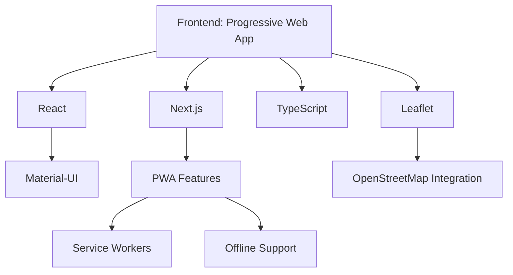
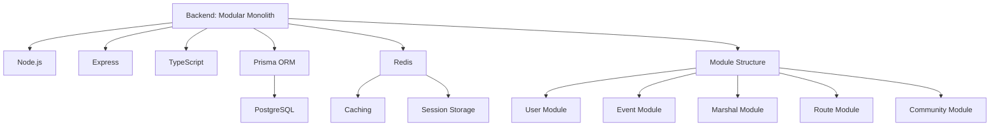
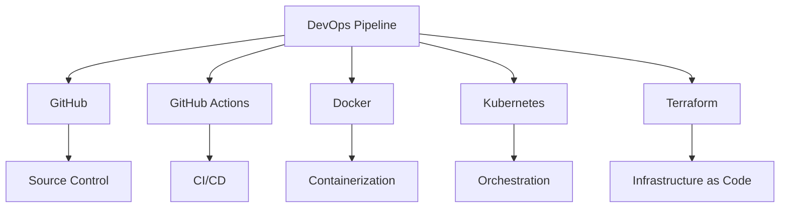
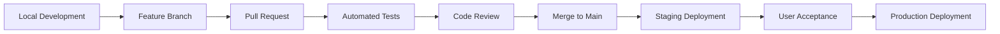

# Sk8Meet Development Plan

## Overview

This document outlines the recommended development approach, technology stack, and implementation strategy for the Sk8Meet platform. Based on the project requirements and architecture documents, we've designed a plan that minimizes software installation on developer machines while ensuring consistent development environments across all platforms (Windows, Linux, macOS).

## Development Approach

### Core Principles

1. **Containerized Development**
   - Docker-based development environment to ensure consistency
   - Minimal local installation requirements (only Docker and VS Code)
   - Cross-platform compatibility for all developer machines

2. **DevOps-First Methodology**
   - Infrastructure as code from day one
   - Automated testing and deployment pipelines
   - Consistent environments across development, staging, and production

3. **Modular Monolith Architecture**
   - Clear separation of concerns with well-defined module boundaries
   - Single deployment unit for simplicity
   - Designed for potential future extraction of services if needed

4. **Mobile-First Design**
   - Progressive Web App (PWA) approach for cross-platform support
   - Offline capabilities for marshals in the field
   - Responsive design for all screen sizes

## Technology Stack

### Frontend

1. **Core Framework**: React with Next.js
   - Server-side rendering for improved performance
   - Static site generation for public pages
   - Built-in API routes for backend communication

2. **Language**: TypeScript
   - Type safety for improved developer experience
   - Better IDE support and error catching
   - Consistent codebase structure

3. **UI Components**: Material-UI
   - Comprehensive component library
   - Mobile-first design approach
   - Customizable theming

4. **State Management**: Redux Toolkit
   - Predictable state management
   - DevTools for debugging
   - Middleware for side effects

5. **Maps Integration**: Leaflet with OpenStreetMap
   - Open-source mapping solution
   - Customizable for skating-specific needs
   - Mobile-friendly controls

### Backend

1. **Runtime**: Node.js with Express
   - Lightweight and flexible
   - Familiar to frontend developers
   - Large ecosystem of libraries

2. **Language**: TypeScript
   - Shared language with frontend
   - Type safety for API contracts
   - Better maintainability

3. **Database Access**: Prisma ORM
   - Type-safe database access
   - Schema-based migrations
   - Multi-schema support for module boundaries

4. **Database**: PostgreSQL
   - Robust relational database
   - JSON support for flexible data
   - Available as managed service on all cloud providers

5. **Caching**: Redis
   - In-memory data store
   - Session management
   - Rate limiting

### DevOps

1. **Source Control**: GitHub
   - Collaborative development
   - Pull request workflow
   - Integrated with CI/CD

2. **CI/CD**: GitHub Actions
   - Automated testing
   - Deployment pipelines
   - Infrastructure validation

3. **Containerization**: Docker
   - Consistent environments
   - Simplified deployment
   - Scalable architecture

4. **Orchestration**: Kubernetes
   - Container orchestration
   - Scaling and self-healing
   - Cloud-agnostic deployment

5. **Infrastructure as Code**: Terraform
   - Declarative infrastructure
   - Version-controlled configuration
   - Multi-cloud support

## Implementation Plan

### Phase 1: Development Environment Setup (2 weeks)

1. **Dev Container Configuration**
   - Set up VS Code Remote Containers
   - Configure Docker Compose for local development
   - Implement hot reloading for both frontend and backend

2. **CI/CD Pipeline Setup**
   - Configure GitHub Actions for testing
   - Set up linting and code quality checks
   - Implement container building and publishing

3. **Database Schema Design**
   - Define initial schema with module boundaries
   - Set up Prisma for database access
   - Create migration and seeding scripts

### Phase 2: Core Platform Implementation (8 weeks)

1. **User and Organization Management**
   - Authentication system
   - Organization creation and configuration
   - Role and permission management

2. **Event Management**
   - Event creation and editing
   - Event calendar and listing
   - Basic notification system

3. **Route Management**
   - OpenStreetMap integration
   - Route creation and storage
   - GPX import/export

### Phase 3: Marshal and Community Features (6 weeks)

1. **Marshal Management**
   - Availability tracking
   - Role assignment
   - Qualification tracking

2. **Community Features**
   - Event registration
   - Feedback collection
   - Public event discovery

3. **Mobile Optimization**
   - Offline capabilities
   - PWA configuration
   - Field testing

### Phase 4: Integration and Deployment (4 weeks)

1. **External API Integration**
   - Public API for external websites
   - Email notification system
   - Social media integration

2. **Production Deployment**
   - Kubernetes configuration
   - Database migration strategy
   - Monitoring and logging setup

3. **Documentation and Training**
   - User documentation
   - Administrator guides
   - Developer onboarding materials

## Development Workflow

1. **Local Development**
   - Developers work in containerized environment
   - Hot reloading for rapid iteration
   - Local database with seed data

2. **Version Control**
   - Feature branch workflow
   - Pull requests for code review
   - Automated checks before merging

3. **Continuous Integration**
   - Automated testing on pull requests
   - Linting and code quality checks
   - Security scanning

4. **Continuous Deployment**
   - Automated deployment to staging
   - User acceptance testing
   - Production deployment with approval

## Resource Requirements

### Development Team

1. **Frontend Developer(s)**
   - React/Next.js experience
   - PWA development knowledge
   - Mobile-first design skills

2. **Backend Developer(s)**
   - Node.js/Express experience
   - Database design skills
   - API development expertise

3. **DevOps Engineer**
   - Docker and Kubernetes experience
   - CI/CD pipeline configuration
   - Infrastructure as code knowledge

### Infrastructure

1. **Development Environment**
   - Developer machines with Docker
   - GitHub repository
   - CI/CD pipeline

2. **Staging Environment**
   - Small Kubernetes cluster
   - Managed PostgreSQL database
   - Monitoring and logging

3. **Production Environment**
   - Scalable Kubernetes cluster
   - Managed PostgreSQL with backups
   - CDN for static assets
   - Monitoring, logging, and alerting

## Conclusion

This development plan provides a comprehensive approach to building the Sk8Meet platform with minimal software installation requirements and consistent development environments. By leveraging containerization, infrastructure as code, and a modular monolith architecture, we can create a scalable, maintainable system that meets the needs of skating communities worldwide.

The detailed implementation in the accompanying [Development Environment Guide](./dev-environment-guide.md) provides specific technical guidance for setting up the development environment and implementing key features.
