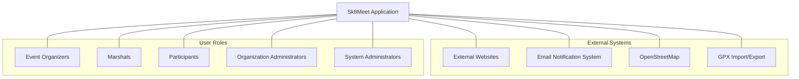

# Sk8Meet: System Context Diagram

The System Context Diagram shows Sk8Meet and its interactions with external systems and user roles.

## System Boundaries and Interactions

### User Interactions

1. **Event Organizers**
   - Create and manage events
   - Plan routes
   - Coordinate marshals
   - Update event status (go/no-go)

2. **Marshals**
   - Indicate availability for events
   - Access event and route information
   - Perform role-specific duties during events
   - Plan routes and add them to personal or organizational libraries
   - Provide feedback on events and routes

3. **Participants**
   - Discover and register for events
   - View event details and routes
   - Provide feedback on events
   - Track personal participation history

4. **Organization Administrators**
   - Manage organization settings
   - Define roles and permissions
   - Invite and approve users
   - Create and manage email distribution lists

5. **System Administrators**
   - Manage system-wide settings
   - Monitor system performance
   - Provide technical support
   - Manage user accounts

### External System Interactions

1. **External Websites**
   - Consume event data via API
   - Display upcoming events
   - Link back to Sk8Meet for registration
   - Examples: londonstreetskates.com, fridaynightskate.com

2. **Email Notification System**
   - Send event notifications to distribution lists
   - Deliver system notifications to users
   - Provide event updates (e.g., go/no-go decisions)

3. **OpenStreetMap**
   - Provide map data for route planning
   - Display routes with skating-specific metadata
   - Support mobile navigation during events

4. **GPX Import/Export**
   - Import routes from external planning tools
   - Export routes for use in other applications
   - Ensure compatibility with standard GPS formats

## Integration Points

### API Endpoints

The Sk8Meet application will expose the following API endpoints for external consumption:

1. **Events API**
   - List upcoming events
   - Get event details
   - Get event status updates

2. **Routes API**
   - List available routes
   - Get route details including GPX data
   - Get route metadata (surface quality, hills, etc.)

3. **Organizations API**
   - List public organizations
   - Get organization details and events

### External APIs Consumed

Sk8Meet will consume the following external APIs:

1. **OpenStreetMap API**
   - Retrieve map data for route planning
   - Display routes on maps
   - Get location information

## Data Flow

1. **Event Creation and Publication**
   - Event Organizers create events in Sk8Meet
   - Events are published to the Sk8Meet platform
   - Published events are available via API to external websites
   - Notifications are sent to relevant email distribution lists

2. **Route Planning**
   - Event Organizers and Marshals create routes using OpenStreetMap integration
   - Routes can be saved to personal libraries or organizational libraries
   - Routes are stored in the Sk8Meet database with skating-specific metadata
   - Routes can be imported/exported in GPX format
   - Routes are associated with events and available to marshals and participants

3. **Marshal Coordination**
   - Marshals indicate availability for events
   - Event Organizers assign roles to marshals
   - Marshals receive notifications about assignments
   - Marshal attendance is tracked during events

4. **Participant Engagement**
   - Participants discover events on Sk8Meet or external websites
   - Participants register interest in events
   - Participants receive event updates
   - Participants provide feedback after events

## Route Library Structure

The route library system will have two levels:

1. **Personal Route Library**
   - Private to individual users (Event Organizers and Marshals)
   - Routes created by the user
   - Routes imported by the user
   - Personal notes and ratings

2. **Organizational Route Library**
   - Shared among all members of an organization
   - Curated collection of proven routes
   - Organization-specific metadata
   - Historical usage information
   - Ability for Marshals and Event Organizers to contribute routes
